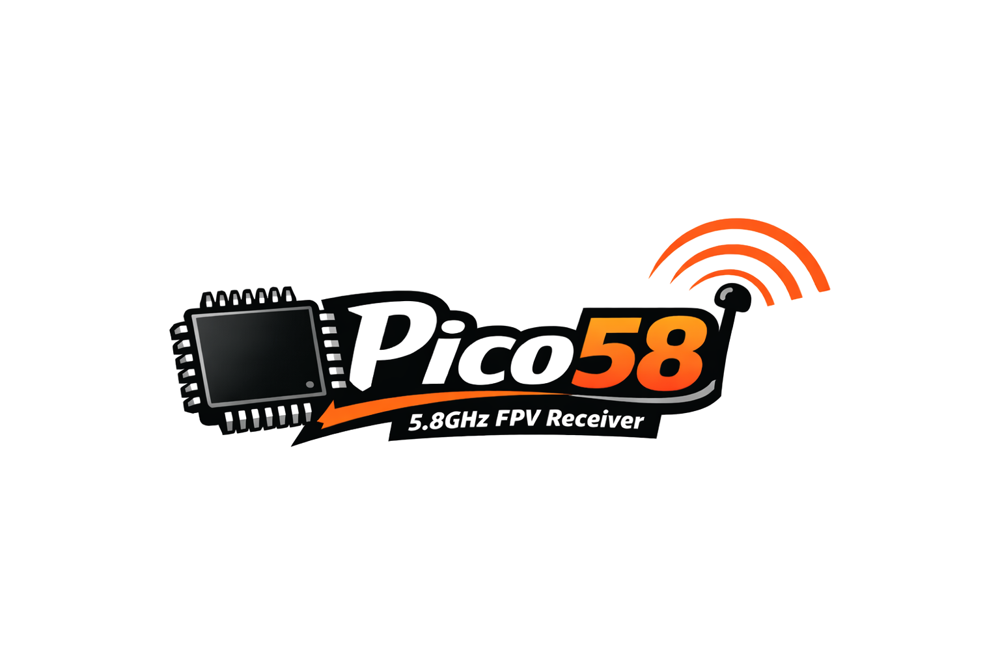

# 

This project is a fork of rx5808-pro-Diversity by Shea Ivey.

Will possibly be making sellable units.

# Table of Contents
1. [Features](#features)
2. [Overview](#overview)
3. [Hardware](#hardware)
4. [Firmware](#firmware)
5. [License](#license)

# Features
- **User control** - 3 Button navigation, up, down, select.
- **Manual Mode** - Set channel manual
- **Search Mode** - Search next channel based on RSSI
- **Band Scanner** - Print spectrum of all 72 channels
- **Auto Save** - Saves settings after a few seconds of inactivity.
- **Beeper** - Acoustic feedback on important actions
- **RSSI Graph** - Running history of RSSI readings.
- **Diversity** - Receiver select and monitor.
- **Led Status** - Power, button pressed, active antenna.
- **Race Band & L-Band** - Total of 72 supported channels.
- **TFT Display** - Use a 135x240 ST7789 Screen.
- **Model Menu** - Creating Unique Models for RSSI Calibration
- **Customization** - 2 preset layouts, 2 colour modes, and 2 screensavers.

1. **Auto Scan** - Scans all bands until a signal with good signal strength is found.
2. **Manual Mode** - Will hold on a manually selected channel.
3. **Band Scanner** - Scans all bands and presents them with a signal strength bar graph.
5. **Settings Menu** - Saves last used channel and mode for next power cycle. This is also where you enter the Model menu and RSSI calibration mode.
    1. **Calibrate RSSI** - Calibrate the min and max RSSI values per model.

#### Initial Setup
When powering on for the first time it is best to calibrate your RSSI modules. No two modules or VRX have the same RSSI min and max readings. To calibrate follow these steps below. You can repeat this process as many times as needed.

1. Go to the settings menu and choose a model. Set it's name if you so wish. Go back to the previous screen and start RSSI Calibration. Follow the steps on screen. Do this per model you will be using.

# Hardware
TBA

#### DIY

This project is centered around the FS58R3MW/RX5808/MM238RW 5.8GHz receiver module and the RP2040 chipset, using an ADG1612 switch. The original rx5808-pro-Diversity schematic has been modified to incorporate the updated MCU and receiver, and some other filtering and decoupling components. Additional LEDs have also been added to show the active receiver.

# Firmware
The firmware is constantly being improved.

## Recognition
- SPI driver based on fs_skyrf_58g-main.c Written by Simon Chambers
- TVOUT by Myles Metzel
- Scanner by Johann Hermen (der-Frickler.net)
- Initial 2 Button version by Peter (pete1990)
- Refactored and GUI reworked by Marko Hoepken
- Universal version my Marko Hoepken
- Diversity Receiver Board and GUI improvements by Shea Ivey
- Adding Race Band by Shea Ivey
- Separating Display concerns for TVOut and OLED by Shea Ivey
- Adding Setup Menu by Shea Ivey
- DIY Throughole board and documentation. by RCDaddy
- Voltage monitoring by kabturek
- v2.0 Firmware Overhaul by @Knifa
- RP2040 Firmware Port by OldManBluntz

# License
## Code
The code is distrubuted under the [MIT license](LICENSE.md).

## Logo
The logo is distributed under the [Creative Commons Attribution 4.0 International](http://creativecommons.org/licenses/by/4.0/) license.
